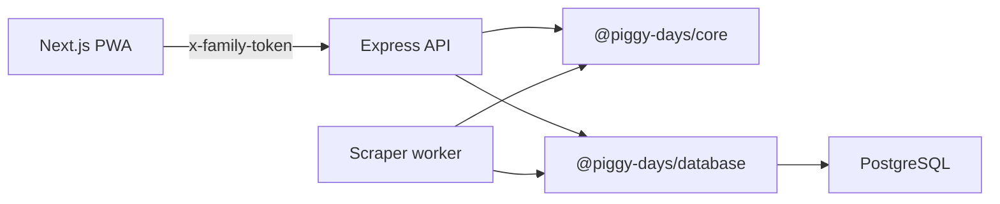

# Piggy Days Architecture

## Goal

Piggy Days is a private two-person PWA with a small but real product architecture:

- A Next.js PWA for the interactive experience.
- An Express API for protected household data and integrations.
- A scraper worker for supermarket price/deal ingestion.
- Shared domain packages so game rules, task types, and pricing rules do not get duplicated.
- PostgreSQL through Prisma for relational data and audit-friendly event history.

The architecture should stay small enough for a personal project, but explicit enough to discuss in a resume or interview.

## Monorepo Layout

```txt
apps/
  web/                 # Next.js PWA
    app/               # Next App Router entrypoints
    features/          # Product features grouped by workflow
      farm/
  api/                 # Express API
    src/
      config/          # Environment parsing
      middleware/      # Auth, validation, error handling
      modules/         # Route modules by domain
        farm/
        tasks/
  scraper/             # Retailer data worker

packages/
  core/                # Shared domain rules and types
    src/
      farm/
      tasks/
      retailers/
  database/            # Prisma schema and generated client wrapper
  ui/                  # Shared theme tokens and future UI primitives
```

## Boundaries

### `packages/core`

Owns pure business logic:

- Task category/status types.
- Farm resources, moods, reward events, XP, levels, dialogue.
- Reward calculation from real-life actions.
- Retailer identifiers.

Rules in this package should be deterministic and easy to unit test. It should not import React, Express, Prisma, or browser APIs.

### `packages/database`

Owns database access:

- Prisma schema.
- Prisma Client generation.
- Shared Prisma client singleton.

API modules import this package when they need persistent data. For the current prototype, some routes still return mock data while the schema stabilizes.

### `apps/api`

Owns HTTP boundaries:

- CORS and JSON middleware.
- Family token auth.
- Request validation.
- Route modules.
- Later: persistence, integrations, background job triggers.

The API should translate HTTP input into validated domain commands, then call `packages/core` and `packages/database`.

### `apps/web`

Owns product experience:

- Mobile-first PWA UI.
- Feature-level components.
- Client-side prototype interactions.
- Later: API client, local session, and installable PWA manifest.

The web app can use mock data while a feature is being designed, but reusable logic should move into `packages/core`.

### `apps/scraper`

Owns retailer data ingestion:

- Retailer adapters for Coles, Woolworths, and ALDI.
- Unit price normalization.
- Deal extraction.
- Scheduled cache writes.

The scraper should not be called on every user search. It writes cached products/deals to PostgreSQL.

## Request Flow



## First MVP Flow

1. User enters the family password.
2. Web stores a local session token.
3. User creates a task.
4. API validates task input and persists it.
5. User completes the task with optional check-in fields.
6. API calculates farm rewards using `@piggy-days/core`.
7. API writes task, check-in, and farm events.
8. Web refreshes farm summary.
9. Farm screen animates resource, mood, garden, and memory changes.

## Engineering Principles

- Keep domain rules pure and tested.
- Keep API input validation close to routes.
- Store reward history as events instead of only mutable counters.
- Prefer feature folders over scattered component folders.
- Use database migrations deliberately.
- Mock external providers first, then swap with adapters.
- Avoid premature platform complexity such as Kubernetes or heavy EC2.

## Resume-Level Talking Points

- Designed a TypeScript monorepo with separate PWA, API, scraper, database, UI, and domain packages.
- Modeled a gamified reward engine that maps task completion, check-ins, outings, and grocery savings into farm resources and memory events.
- Used event-style farm history so the UI can derive summaries, timelines, unlocks, and future analytics.
- Planned adapter-based supermarket ingestion for Coles, Woolworths, and ALDI.
- Built the project as a deployable AWS-oriented PWA/API system while keeping the local MVP lightweight.
