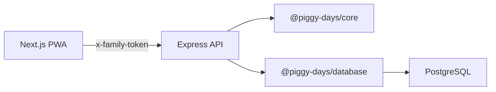
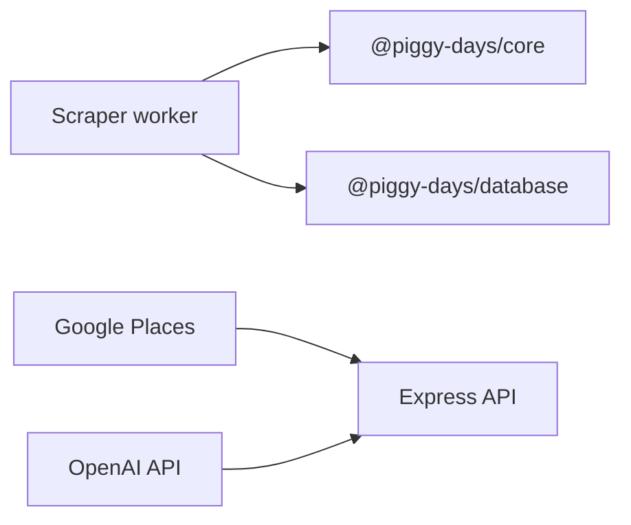

# Piggy Days Architecture

## Goal

Piggy Days is a private bilingual PWA for two people. The architecture should support a daily todo/checklist loop first, then Piggy Coins/Fund, reviews, memory wall, and a lightweight farm reward surface.

Keep the system small enough for a personal project, but structured enough to grow into a serious portfolio project.

## Main Decision

Use one web app, not multiple apps.

The product workflows are connected:

```txt
Task/checklist completion -> CoinEvent -> Piggy Fund -> Leaderboard -> Review -> Memory/Farm
```

Splitting these into separate apps would add friction and duplicate state. Use routes inside one PWA instead.

## Monorepo Layout

```txt
apps/
  web/                 # Next.js PWA
    app/               # App Router route entrypoints
    features/          # Product features by workflow
      farm/
      kitchen/
      tasks/
      fund/
      settings/
    lib/
      i18n/
      api/
  api/                 # Express API
    src/
      config/
      middleware/
      modules/
        auth/
        tasks/
        checklists/
        coins/
        fund/
        reviews/
        farm/
        kitchen/
  scraper/             # Future retailer data worker

packages/
  core/                # Shared pure domain rules
  database/            # Prisma schema and client wrapper
  ui/                  # Shared tokens/components
```

## Route Plan

Route existence does not mean feature exposure. A route can exist while the feature is still hidden from primary navigation.

Feature maturity:

```txt
planned -> route-only -> prototype -> beta -> active
```

Exposure rules:

- `active`: primary navigation or core `/today` area.
- `beta`: secondary card on `/today` or settings link.
- `prototype`: experiment link or direct route.
- `route-only`: route exists with placeholder, no normal entry.
- `planned`: docs only.

### Initial Routes

```txt
/             -> redirect to /today
/today        -> daily home
/tasks        -> task and checklist list
/tasks/[id]   -> task detail and checklist completion
/fund         -> Piggy Fund, coin ledger, leaderboard
/farm         -> piggy reward surface
/kitchen      -> dinner planning prototype
/settings     -> language, current user, session
```

Initial primary navigation:

```txt
今天 / 任务 / 基金 / 小猪 / 设置
```

Kitchen can exist at `/kitchen`, but should remain a secondary/prototype entry until it passes real home testing.

### Later Routes

```txt
/explore      -> outing checklist generator
/review       -> weekly review generator
/memories     -> memory wall
/shop         -> manual shopping and later comparison
```

## Frontend Boundaries

### `apps/web/app`

Owns route entrypoints and app shell layout.

### `apps/web/features`

Owns feature UI and local workflow state:

- `tasks`: task forms, list, detail, checklist UI.
- `fund`: balance, coin ledger, leaderboard.
- `farm`: reward surface and existing farm prototype.
- `kitchen`: dinner planning and cooking checklist conversion.
- `settings`: language/current user/session controls.
- `explore`, `review`, `memories`, `shop`: added later.

### `apps/web/lib/i18n`

Owns local dictionaries and language selection.

Rules:

- Default to `zh-CN`.
- Support `en`.
- Store selected locale in local storage for v1.
- Do not translate user-entered content.

### `apps/web/lib/api`

Owns typed API helpers and request headers.

Responsibilities:

- Read `NEXT_PUBLIC_API_BASE_URL`.
- Attach `x-family-token` when configured.
- Return clear error messages.
- Keep React Query hooks thin and feature-scoped.

## Backend Boundaries

### `apps/api`

Owns HTTP boundaries:

- CORS and JSON middleware.
- Family token auth.
- Request validation.
- Route modules.
- Persistence calls.

The API should translate HTTP input into validated domain commands, then call `packages/core` and `packages/database`.

### Suggested API Modules

- `auth`: family login.
- `tasks`: task CRUD and task completion.
- `checklists`: checklist item CRUD and completion.
- `coins`: coin events.
- `fund`: derived balance and leaderboard.
- `reviews`: deterministic review generation.
- `farm`: farm projection from coins/reviews.
- `kitchen`: kitchen inventory and dinner recommendations.

Shopping, scraper, Places, and AI modules come later.

## Shared Packages

### `packages/core`

Owns pure business logic:

- Task/category/status types.
- Checklist progress rules.
- Coin reward rules.
- Piggy Fund derivation helpers.
- Leaderboard aggregation helpers.
- Kitchen recommendation rules.
- Review summary helpers.
- Farm projection rules.
- Later: retailer and pricing helpers.

Rules in this package should be deterministic and easy to unit test. It should not import React, Express, Prisma, or browser APIs.

### `packages/database`

Owns database access:

- Prisma schema.
- Prisma Client generation.
- Shared Prisma client singleton.

### `packages/ui`

Owns shared UI primitives and tokens only when patterns repeat. Do not create generic abstractions before the screens prove the need.

## Request Flow



Later:



## First MVP Flow

1. User opens `/today`.
2. App defaults to Simplified Chinese.
3. User selects current identity: me or wife.
4. User creates a task and sets a Piggy Coin reward.
5. API validates input and persists the task.
6. User completes the task with optional check-in fields.
7. API writes `CheckIn` and immutable `CoinEvent`.
8. Piggy Fund and leaderboard are derived from coin events.
9. Web refreshes `/today`, `/tasks`, and `/fund`.
10. `/farm` shows a lightweight reward/memory projection.

## Pagination and List Strategy

Use filters before traditional pagination.

Task lists:

- Filter by status, owner, category, and date range.
- Sort todo/in-progress first, newest updated next.

Coin ledger:

- Show recent events.
- Use `limit` and `cursor` for loading more.

Memory wall:

- Group by review range or month.

Avoid page-number UI in v1. It feels heavy for a two-person personal app.

## Engineering Principles

- Build the app shell before adding more feature surfaces.
- Keep domain rules pure and tested.
- Keep API input validation close to routes.
- Store reward history as immutable events.
- Derive balances and leaderboard from events.
- Keep Chinese copy first-class.
- Prefer feature folders over scattered component folders.
- Mock external providers first, then swap with adapters.
- Avoid premature platform complexity.

## Resume-Level Talking Points

- Designed a TypeScript monorepo with separate PWA, API, scraper, database, UI, and domain packages.
- Modeled a private two-person task/checklist system with an event-sourced reward ledger.
- Derived Piggy Fund, leaderboard, review history, and farm projection from immutable coin events.
- Added bilingual UI architecture with Chinese-first copy and English fallback.
- Planned route-based product architecture for a mobile-first PWA.
- Kept AI, retailer scraping, Places, and richer game mechanics as later adapters instead of MVP blockers.
